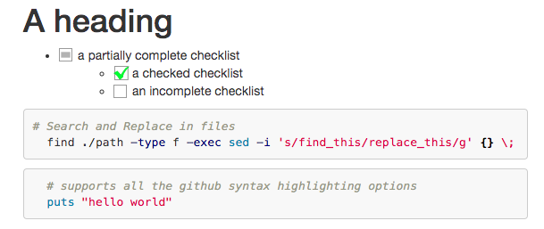

# VimwikiMarkdown
 

This gem allows vimwiki pages written in (github enhanced) markdown
to be converted to HTML.

It is currently a work in progress (but working for me ;)

## Example
It turns this:

into

## Requirements

Ruby installed on your computer & up to date version of vimwiki

    https://www.ruby-lang.org/en/installation/

Install the vimwiki_markdown gem

    $ gem install vimwiki_markdown

## Setup

vimwiki_markdown works best with a recent version of [vimwiki](https://github.com/vimwiki/vimwiki). Use the `dev` branch for best results.

Ensure that your vimiwiki directive in your .vimrc is setup for markdown.  For
this we use the custom_wiki2html parameter.  My .vimrc looks like this:

    let g:vimwiki_list = [{'path': '~/vimwiki', 'template_path': '~/vimwiki/templates/',
              \ 'template_default': 'default', 'syntax': 'markdown', 'ext': '.md',
              \ 'path_html': '~/vimwiki/site_html/', 'custom_wiki2html': 'vimwiki_markdown',
              \ 'html_filename_parameterization': 1,
              \ 'template_ext': '.tpl'}]

The most important parts are the *'custom_wiki2html': 'vimwiki_markdown'* and the *'html_filename_parameterization': 1*. The custom_wiki2html tells vimwiki to use this gem for creating html, the html_filename_parameterization tells vimwiki to match the filenames that vimwiki_markdown produces.

### Install issues.
There have been some issues with getting dependencies installed. Before opening an issue, please check if you can use [rvm](http://rvm.io/) to install the gem, as RVM is magic and makes everything work ;)

### VimWiki Template

It is a requirement that your template file contain a placeholder
for the syntax highlighting code to be placed.  In order to do this,
open up your default.tpl (or whatever your template file is called)
and ensure that before the closing </head> tag you put
`%pygments%`

A sample tpl file is available here https://raw.githubusercontent.com/patrickdavey/vimwiki_markdown/master/example_files/default.tpl

#### Optional %root_html% marker.

You can also have a `%root_html%` marker in your template file, thanks
to [this commit](https://github.com/patrickdavey/vimwiki_markdown/commit/8645883b96df9962aba616d0d12961285cd3f4d7).
It will get rewritten with the relative path to the root
of the site (e.g. `./` or `../../` etc)

#### Optional %date% marker.

You can also have a `%date%` marker in your template file
It will get rewritten with todays date in the format 29 March 2019

#### Support for tasklists
Vimwiki has support for complex todo lists which you can [read about in their help.txt](https://github.com/vimwiki/vimwiki/blob/619f04f89861c58e5a6415a4f83847752928252d/doc/vimwiki.txt#L1768). We do support turning them into HTML. This is _slightly different_ from the way that GitHub checklists are rendered, but, the syntax is a subset of GitHub lists so it should be fine. You can read about it in the [issue](https://github.com/patrickdavey/vimwiki_markdown/issues/27), but basically it should work fine.  You will want to add `styles` in for the various states that the todo lists can be in. The easiest way is to simply add the `styles` into your template. You can see the styles [in the sample template here](https://github.com/patrickdavey/vimwiki_markdown/blob/293f99e656819b9c5ecc0c831698ce58904eb774/example_files/default.tpl#L7-L45)

#### Support for :local and :file links

We have partial support for the `:local` and `:file` link types for vimwiki.
If you are editing `foo.md` (in the root dir of your wiki) and you are linking to `bar.txt` stored in the same directory as `foo.md` you can do:

* `[link text](local:bar.txt)` when output to HTML becomes `<a href="../bar.txt">link text</a>`
* `[link text](file:bar.txt)` when output to HTML becomes `<a href="/absolute/path/to/file">link text</a>`

#### Optional %nohtml

If you place the text %nohtml anywhere in a wiki page, it will not be processed into html

## Contributing

Pull requests are very welcome

1. Fork it ( https://github.com/patrickdavey/vimwiki_markdown/fork )
2. Create your feature branch (`git checkout -b my-new-feature`)
3. Commit your changes (`git commit -am 'Add some feature'`)
4. Push to the branch (`git push origin my-new-feature`)
5. Create a new Pull Request

## License

[MIT License](http://opensource.org/licenses/mit-license.php)
